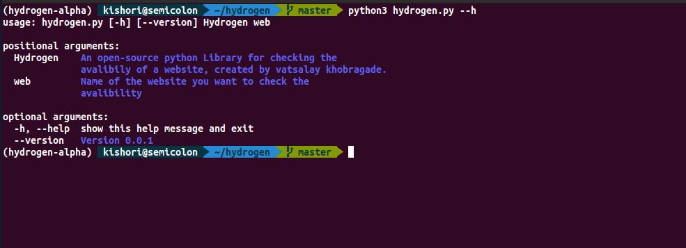

  <h1 align="center">Hydrogen</h1>
  <h4 align="center">An Open Source Command Line Application for Site Checking</h4>

**Usage**

Hydrogen takes just one positional argument: Web. The website you want to check the availibility for. Right now Hydrogen is in its developement stage.  
